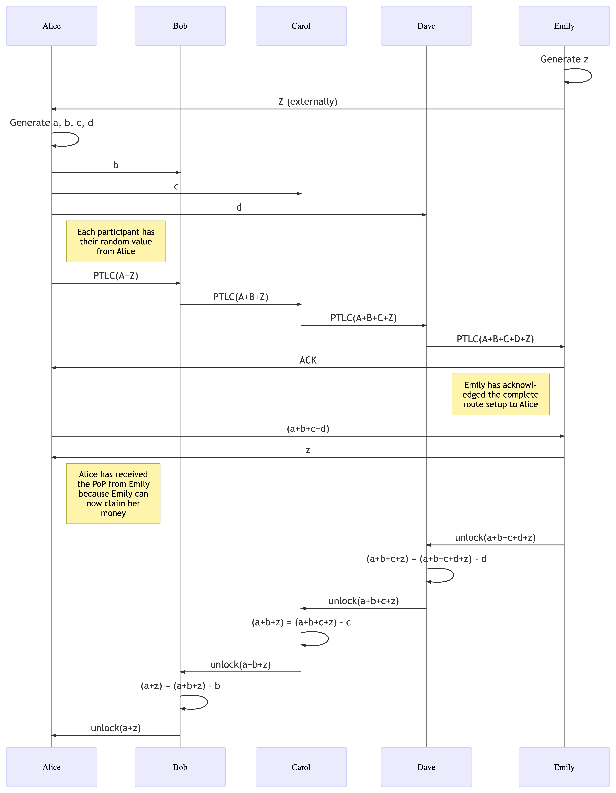

# Extension BOLT XX: Point Timelock Contracts

## Abstract

## Motivation

## Mechanism Overview

Point Timelock Contracts differ from HTLCs in that the opening of a commitment is not the revelation
of a hash preimage, but rather the revelation of a discrete logarithm.

The mechanism is best illustrated by an example:



In the above diagram, let's drill down into the communication between Carol and Dave. In an HTLC
scenario, Carol would send Dave an `update_add_htlc` message containing various fee information,
as well as an onion packet containing the information sent by Alice.

In the PTLC scenario, however, Carol must instead prepare a commitment that would be opened by
a discrete log, i. e. a signature verification tied to a specific public key.

Further, because Dave's signature must necessarily reveal to Carol how to open the commitment that
she, in turn, received from Bob, we must work with Adaptor signatures, which means that we need
one signature set up beforehand, which does not open the commitment, and one signature afterwards
that does. The delta between those signatures must be fixed beforehand.

Here's how such a scheme could look:

1. Carol sends Dave the following:
- `A + B + C + Z`: the PTLC point that Dave will need to open
- `P`: a random pubkey where `P = x * G`
- `R`: a random nonce
- an Adaptor signature `s' = h(R || P + A+B+C+Z || m) * x + r`

Dave now has an Adaptor signature where the following holds true:

- `s'` is not a valid signature
- `h(R || P + A+B+C+Z || m) * (P + A+B+C+Z) + R - (s' * G) = h(R || P + A+B+C+Z || m) * (A+B+C+Z)`
- A valid signature would be `s = h(R || P + A+B+C+Z || m) * (x + a+b+c+z) + r
- ```
  s - s' = h(R || P + A+B+C+Z || m) * (a+b+c+z) <=>
  <=> a+b+c+z = h(R || P + A+B+C+Z || m)^(-1) * (s - s')
  ```
- Carol cannot unilaterally produce a valid signature
- Dave can produce a valid signature if he learns `a+b+c+z`, but only by modifying `s'`
  - This guarantees that if ever a valid signature is produced, it is necessarily one from which
    Carol can infer `a+b+z`.

To "bind" this PTLC, the updated commitment transaction should require an `OP_CHECKSIGVERIFY` where
the public key is `P + A+B+C+Z`, i. e. the random key generated by Carol tweaked with the PTLC
commitment. Let's call it `unique_ptlc_pubkey`.

## Messaging Changes

### `update_offer_ptlc`

1. type: 128.5 (`update_offer_ptlc`)
2. data:
   - `channel_id`: `channel_id
   - `u64`: `id`
   - `u64`: `amount_msat`
   - `u32`: `cltv_expiry`
   - `pubkey`: PTLC commitment pubkey (e. g. `A+B+C+Z`)
   - `pubkey`: `random_ptlc_pubkey`
   - `pubkey`: `random_ptlc_nonce`
   - `1366*byte`: `onion_routing_packet`

## Sphinx Changes

### Hop Data Extensions

1. `tlv_stream`: `tlv_payload
2. types:
   1. type 10 (`ptlc_secret`)
   2. data:
      - `32*byte`: `ptlc_secret` (e. g. the `d` sent from Alice to David)

## Script Changes

The only script changes are to the `htlc_success`, now `ptlc_success` branch of the Taptree.

### Offered PTLCs

`ptlc_success`:

```
<unique_ptlc_pubkey> OP_CHECKSIGVERIFY // SIGHASH_SINGLE | SIGHASH_ANYONECANPAY
<remote_ptlc_pubkey> OP_CHECKSIG // SIGHASH_ALL
OP_CHECKSEQUENCEVERIFY
```

#### Rationale

~~Because the PTLC MuSig2 signature requires buy-in from both the local and the remote parties,
the need to check individual parties' signature is obviated, so we can remove
`<remote_ptlc_pubkey> OP_CHECKSIG`.~~

### Accepted PTLCs

`ptlc_success`:

```
<unique_ptlc_pubkey> OP_CHECKSIGVERIFY // SIGHASH_SINGLE | SIGHASH_ANYONECANPAY
<local_ptlc_pubkey> OP_CHECKSIG // SIGHASH_ALL
```

#### Rationale

~~Because the PTLC MuSig2 signature requires buy-in from both the local and the remote parties,
the need to check individual parties' signature is obviated, so we can remove
`<local_ptlc_pubkey> OP_CHECKSIGVERIFY` and `<remote_ptlc_pubkey> OP_CHECKSIG`, and can instead
make the PTLC's check an `OP_CHECKSIG` instead of an `OP_CHECKSIGVERIFY`.~~